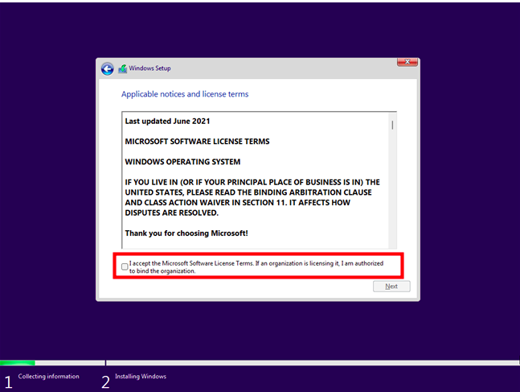
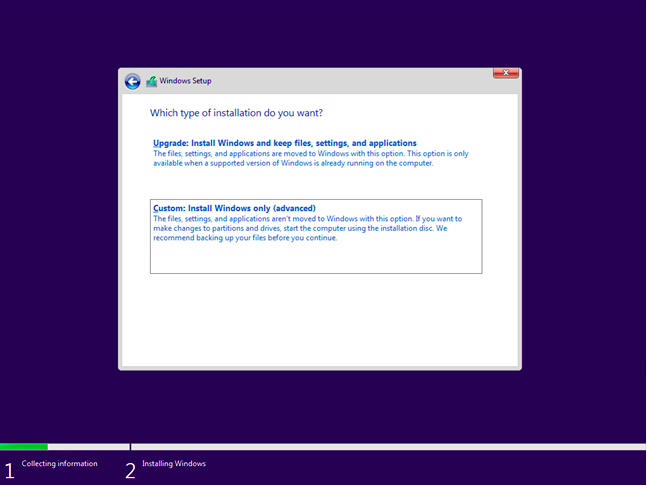
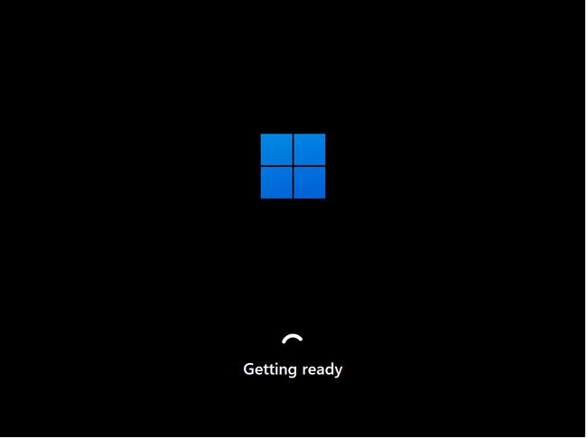

# Dev_Setup
Setup Development Environment

#Assignment: Setting Up Your Developer Environment

#Objective:
This assignment aims to familiarize you with the tools and configurations necessary to set up an efficient developer environment for software engineering projects. Completing this assignment will give you the skills required to set up a robust and productive workspace conducive to coding, debugging, version control, and collaboration.

#Tasks:

1. Select Your Operating System (OS):
   Choose an operating system that best suits your preferences and project requirements. Download and Install Windows 11. https://www.microsoft.com/software-download/windows11

- First Check Compatibility: Ensure  computer meets the minimum system requirements for Windows 11. one can use the official Microsoft PC Health Check app (https://support.microsoft.com/en-us/windows/how-to-use-the-pc-health-check-app-9c8abd9b-03ba-4e67-81ef-36f37caa7844) to perform a compatibility check.

- click the link {https://www.microsoft.com/software-download/windows11} and Download Windows 11 Disk Image (ISO) for x64 devices, Create Windows 11 Installation Media. 
- Boot your PC from the Windows 11 installation disc, USB stick, or ISO file. Wait for a couple of seconds, and your computer or device should briefly display a message asking you to “Press any key to boot from CD or DVD.” Then, regardless of whether you want to boot from a USB stick or DVD/ISO file, press any key on your keyboard to load the Windows 11 Setup wizard.
   this is what will be seen

- Then, the Windows 11 Setup wizard starts. It first asks you what language, time and currency format, and keyboard input settings you’d like to use. Choose what you prefer and press Next.
  this window appears 

- Click the Install now button to proceed with the Windows 11 installation.
  this window appears 

- Windows 11 asks you to enter a product key. If you’re reinstalling Windows 11 or previously had a Windows 10 copy installed on this PC, click or tap on “I don't have a product key.”
  this window will appear 

- The Windows Setup asks you to select which edition of Windows 11 you’d like to install. Choose the one you want and press Next.
  this is what appears 

- Microsoft presents you with the “Applicable notices and license terms” for Windows 11. Read what the company has to say, and if you want to continue installing Windows 11, check the box at the bottom of the window to accept the terms and press Next.
  this is what appears in this stage 

- Next comes the step where you must choose how to install Windows 11: as an Upgrade or as a Custom installation. Otherwise, for a clean install of Windows 11 from scratch, select “Custom: Install Windows only (advanced).
  this is what appears 

- now, you get to choose where to install Windows 11. Select the drive or partition for it, and then press Next. If you need or want to configure partitions manually in a specific way, you can use the options found under the list of drives. You can create new partitions, delete old ones, format them, and so on. Once you’re done, press Next.
  this is what appears 

- The actual Windows 11 installation process begins. First, you’ll have to wait a couple of minutes for the required files to be copied and for Windows 11’s features to be installed on your PC. this step may take longer may be short depending on if you use a hard disk or a solid-state drive.
  this is what appears  

- The setup wizard should automatically reboot once the Windows 11 files have been copied and its features installed. When that happens, you’re notified, and to hurry the process a bit, press the Restart now button instead of waiting for 10 seconds.
  this is what appears  

- After rebooting, you see a few messages telling you that Windows 11 is running scripts and getting ready. Wait for it to do its thing without shutting down your PC.
  this is what appears 

- As the installation is almost over, now comes the time to customize Windows 11. First, the setup wizard asks you in what country or region you live. Choose it from the list, and then click or tap Yes.
  this is what appears 

- Then, select the keyboard layout that you prefer using and press Yes.
  this screen appears 

- You can add a second one if you intend to use more than just one keyboard layout. If you don’t, click or tap Skip.
  this screen is what appears 

- If your computer is connected to the internet, Windows 11 will check for and install any available updates. Wait for this process to finish.
  this is the screen that is seeen. 

- Next, the Windows 11 Setup asks if you’d like to name your PC. Type the name you want, and press Next. If you’re OK with a name chosen by Microsoft, you can press “Skip for now.”
  this is the screen seen at this stage 

- Windows 11 continues by asking you how you’d like to set up your device: “Set up for personal use” or “Set up for work or school.” Ifyou are home user, you should choose “Set up for personal use” and press Next.
  this is the screen seen

- Whether you’re using the Home or Pro editions, Windows 11 asks you to sign in with your Microsoft account.
  this is the screen that appears  

- Enter your Microsoft email, phone number, or Skype ID in the Sign in field, and click or tap Next.
  this is the screen that appears 

- You are also asked whether you want to restore your folders, apps, settings, and credentials from another computer of yours.
  this is the screen that appears  

- Next, Windows 11 asks you to create a PIN for quick sign-ins. Click or tap on Create PIN.
  this is the screen that appears 

- Enter the PIN code you want, confirm it, and press OK.
  this is the screen that appears 

- next step, Windows 11 lets you customize “privacy settings for your device.” You can enable or disable any available features: Location, Find my device, Diagnostic data, Inking & typing, Tailored experiences, and Advertising ID.
  this is the screen seen at this stage 

- Windows 11 asks you how you intend to use your PC. For example,  for Development, Entertainment, Gaming, School, Creativity, Business, or Family? Windows 11 will deliver personalized tips, ads, and recommendations depending on your choice. 
  this is the screen that appears 

-  Windows 11 recommends using your Android phone from your PC. If you want to be able to use the Phone Link app on your PC, follow the instructions on the screen and scan the QR code with your smartphone
  this is the screen that appears 

- Next, Microsoft will try to sway you into buying some of its services. 
  this is the screen that appears, click decline and proceed to the next step 

- Finally, Windows 11 does another update check. If it finds any available updates, you have to wait for them to be downloaded and installed.
  this is the screen that appears 

- Windows 11 automatically logs you in, telling you to wait for a couple of moments while getting things ready for you.
  this is the window that appears 

- Finally, it displays the desktop and the Start Menu, and you can start using Windows 11.
  this is the window that is displayed 

2. Install a Text Editor or Integrated Development Environment (IDE):
   Select and install a text editor or IDE suitable for your programming languages and workflow. Download and Install Visual Studio Code. https://code.visualstudio.com/Download

   
3. Set Up Version Control System:
   Install Git and configure it on your local machine. Create a GitHub account for hosting your repositories. Initialize a Git repository for your project and make your first commit. https://github.com

4. Install Necessary Programming Languages and Runtimes:
  Instal Python from http://wwww.python.org programming language required for your project and install their respective compilers, interpreters, or runtimes. Ensure you have the necessary tools to build and execute your code.

5. Install Package Managers:
   If applicable, install package managers like pip (Python).

6. Configure a Database (MySQL):
   Download and install MySQL database. https://dev.mysql.com/downloads/windows/installer/5.7.html

7. Set Up Development Environments and Virtualization (Optional):
   Consider using virtualization tools like Docker or virtual machines to isolate project dependencies and ensure consistent environments across different machines.

8. Explore Extensions and Plugins:
   Explore available extensions, plugins, and add-ons for your chosen text editor or IDE to enhance functionality, such as syntax highlighting, linting, code formatting, and version control integration.

9. Document Your Setup:
    Create a comprehensive document outlining the steps you've taken to set up your developer environment. Include any configurations, customizations, or troubleshooting steps encountered during the process. 

#Deliverables:
- Document detailing the setup process with step-by-step instructions and screenshots where necessary.
- A GitHub repository containing a sample project initialized with Git and any necessary configuration files (e.g., .gitignore).
- A reflection on the challenges faced during setup and strategies employed to overcome them.

#Submission:
Submit your document and GitHub repository link through the designated platform or email to the instructor by the specified deadline.

#Evaluation Criteria:**
- Completeness and accuracy of setup documentation.
- Effectiveness of version control implementation.
- Appropriateness of tools selected for the project requirements.
- Clarity of reflection on challenges and solutions encountered.
- Adherence to submission guidelines and deadlines.

Note: Feel free to reach out for clarification or assistance with any aspect of the assignment.
