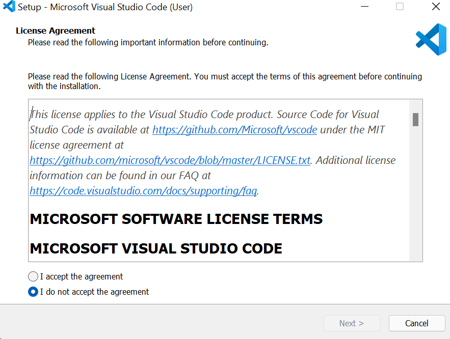
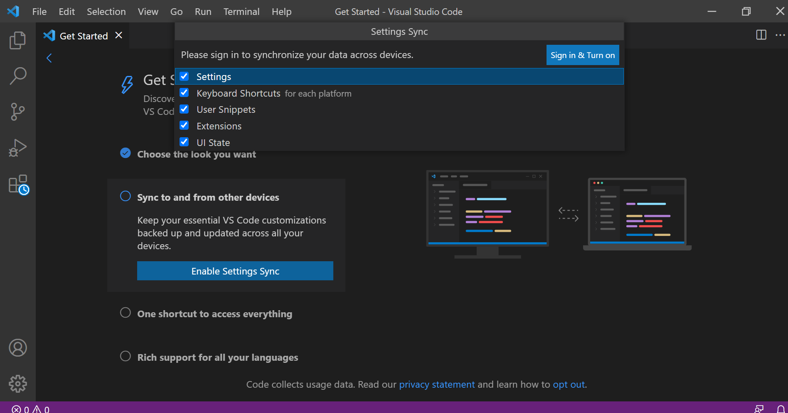
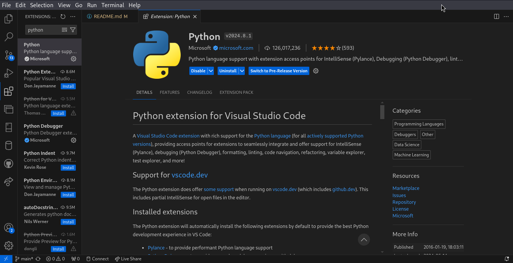
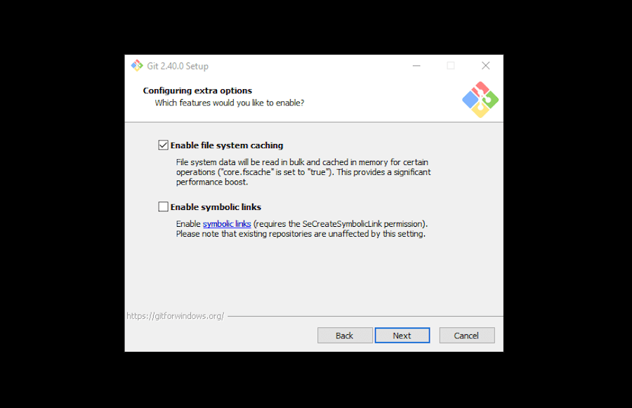
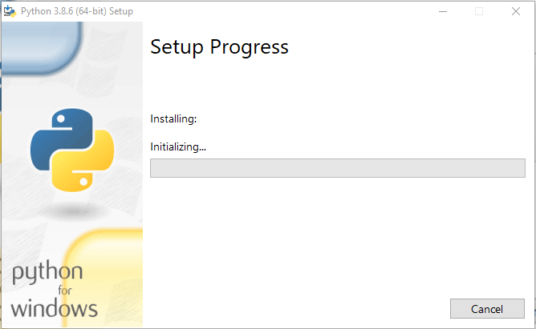

# Dev_Setup
Setup Development Environment

#Assignment: Setting Up Your Developer Environment

#Objective:
This assignment aims to familiarize you with the tools and configurations necessary to set up an efficient developer environment for software engineering projects. Completing this assignment will give you the skills required to set up a robust and productive workspace conducive to coding, debugging, version control, and collaboration.

#Tasks:

1. Select Your Operating System (OS):
   Choose an operating system that best suits your preferences and project requirements. Download and Install Windows 11. https://www.microsoft.com/software-download/windows11

- First Check Compatibility: Ensure  computer meets the minimum system requirements for Windows 11. one can use the official Microsoft PC Health Check app (https://support.microsoft.com/en-us/windows/how-to-use-the-pc-health-check-app-9c8abd9b-03ba-4e67-81ef-36f37caa7844) to perform a compatibility check.

- click the link {https://www.microsoft.com/software-download/windows11} and Download Windows 11 Disk Image (ISO) for x64 devices, Create Windows 11 Installation Media. 
- Boot your PC from the Windows 11 installation disc, USB stick, or ISO file. Wait for a couple of seconds, and your computer or device should briefly display a message asking you to “Press any key to boot from CD or DVD.” Then, regardless of whether you want to boot from a USB stick or DVD/ISO file, press any key on your keyboard to load the Windows 11 Setup wizard.
   this is what will be seen

- Then, the Windows 11 Setup wizard starts. It first asks you what language, time and currency format, and keyboard input settings you’d like to use. Choose what you prefer and press Next.
  this window appears 

- Click the Install now button to proceed with the Windows 11 installation.
  this window appears 

- Windows 11 asks you to enter a product key. If you’re reinstalling Windows 11 or previously had a Windows 10 copy installed on this PC, click or tap on “I don't have a product key.”
  this window will appear 

- The Windows Setup asks you to select which edition of Windows 11 you’d like to install. Choose the one you want and press Next.
  this is what appears 

- Microsoft presents you with the “Applicable notices and license terms” for Windows 11. Read what the company has to say, and if you want to continue installing Windows 11, check the box at the bottom of the window to accept the terms and press Next.
  this is what appears in this stage 

- Next comes the step where you must choose how to install Windows 11: as an Upgrade or as a Custom installation. Otherwise, for a clean install of Windows 11 from scratch, select “Custom: Install Windows only (advanced).
  this is what appears 

- now, you get to choose where to install Windows 11. Select the drive or partition for it, and then press Next. If you need or want to configure partitions manually in a specific way, you can use the options found under the list of drives. You can create new partitions, delete old ones, format them, and so on. Once you’re done, press Next.
  this is what appears 

- The actual Windows 11 installation process begins. First, you’ll have to wait a couple of minutes for the required files to be copied and for Windows 11’s features to be installed on your PC. this step may take longer may be short depending on if you use a hard disk or a solid-state drive.
  this is what appears  

- The setup wizard should automatically reboot once the Windows 11 files have been copied and its features installed. When that happens, you’re notified, and to hurry the process a bit, press the Restart now button instead of waiting for 10 seconds.
  this is what appears  

- After rebooting, you see a few messages telling you that Windows 11 is running scripts and getting ready. Wait for it to do its thing without shutting down your PC.
  this is what appears 

- As the installation is almost over, now comes the time to customize Windows 11. First, the setup wizard asks you in what country or region you live. Choose it from the list, and then click or tap Yes.
  this is what appears 

- Then, select the keyboard layout that you prefer using and press Yes.
  this screen appears 

- You can add a second one if you intend to use more than just one keyboard layout. If you don’t, click or tap Skip.
  this screen is what appears 

- If your computer is connected to the internet, Windows 11 will check for and install any available updates. Wait for this process to finish.
  this is the screen that is seeen. 

- Next, the Windows 11 Setup asks if you’d like to name your PC. Type the name you want, and press Next. If you’re OK with a name chosen by Microsoft, you can press “Skip for now.”
  this is the screen seen at this stage 

- Windows 11 continues by asking you how you’d like to set up your device: “Set up for personal use” or “Set up for work or school.” Ifyou are home user, you should choose “Set up for personal use” and press Next.
  this is the screen seen

- Whether you’re using the Home or Pro editions, Windows 11 asks you to sign in with your Microsoft account.
  this is the screen that appears  

- Enter your Microsoft email, phone number, or Skype ID in the Sign in field, and click or tap Next.
  this is the screen that appears 

- You are also asked whether you want to restore your folders, apps, settings, and credentials from another computer of yours.
  this is the screen that appears  

- Next, Windows 11 asks you to create a PIN for quick sign-ins. Click or tap on Create PIN.
  this is the screen that appears 

- Enter the PIN code you want, confirm it, and press OK.
  this is the screen that appears 

- next step, Windows 11 lets you customize “privacy settings for your device.” You can enable or disable any available features: Location, Find my device, Diagnostic data, Inking & typing, Tailored experiences, and Advertising ID.
  this is the screen seen at this stage 

- Windows 11 asks you how you intend to use your PC. For example,  for Development, Entertainment, Gaming, School, Creativity, Business, or Family? Windows 11 will deliver personalized tips, ads, and recommendations depending on your choice. 
  this is the screen that appears 

-  Windows 11 recommends using your Android phone from your PC. If you want to be able to use the Phone Link app on your PC, follow the instructions on the screen and scan the QR code with your smartphone
  this is the screen that appears 

- Next, Microsoft will try to sway you into buying some of its services. 
  this is the screen that appears, click decline and proceed to the next step 

- Finally, Windows 11 does another update check. If it finds any available updates, you have to wait for them to be downloaded and installed.
  this is the screen that appears 

- Windows 11 automatically logs you in, telling you to wait for a couple of moments while getting things ready for you.
  this is the window that appears 

- Finally, it displays the desktop and the Start Menu, and you can start using Windows 11.
  this is the window that is displayed 

2. Install a Text Editor or Integrated Development Environment (IDE):
   Select and install a text editor or IDE suitable for your programming languages and workflow. Download and Install Visual Studio Code. https://code.visualstudio.com/Download

- Step 2: Visit https://code.visualstudio.com/download and download the version specific to your OS. For my case it is windows. once you visit the above link you land at this page. 

 - step 2: Download process will start. This screen is seen at this step.
 

 - step 3: Once the download is complete. Open the file and accept the agreement., you can also open the file by navigating to the folder where the file was stored after being doenloaded and double click on it. 
 this is the image that is seen at this stage. 

- step 4: Select the drive location where you need to install the VS Code.
use the default location. This is the image that is seen at this stage. 

- step 5: Next, you have to Select the folder name for the VS Code setup files. This is the window that appears. 

- step 6: Next, Select the additional task, that you want to do by the installer. like, you may want to have "Open with Code" added to both the File and Directory content menu, hence you have to selected those. This is the image that appears. 

- step 7: In this step, Check if all the settings.AS shown below

- step 8: Here, you click the install button and the installation proces begins. As shown below. 

- step 9: Once the installations is complete click "Finish". as shown below.

- step 10: After VS code has opened, choose the theme. as shown below

- step 11: Here you can sync all your setting either with GitHub or Microsoft Account.As shown below.

- step 12: In this step, Select what all you want to Sync. Click "Sign-in & Turn on".

- step 13: Go to the extensions, using Ctrl+Shift+X and search for the extensions that you need to use. here are some of the extensions that I have installed.
 
 
 
 
 

3. Set Up Version Control System:
   Install Git and configure it on your local machine. Create a GitHub account for hosting your repositories. Initialize a Git repository for your project and make your first commit. https://github.com

- How To Install Git on Windows 11
- Step 1: Download the Windows Installer: by visting the Official Git website "https://git-scm.com/download/win" 

- Step 2: Run the Installer:  Confirm that the app can make changes to your device by clicking Yes

- Step 3: The installer will request an installation location. Keep the default unless you need to change it, and click Next.

-Step 4: A component selection screen will be displayed. Keep the default settings unless you need to modify them, and click Next.

- Step 5: A prompt to create a start folder will appear as shown. Leave it as is and click Next.

- Step 6: Choose a text editor to use with Git. Click on the drop-down menu to pick the text editor like Vim, Notepad++, etc and click Next.

- Step 7: In this step, one can opt to rename your initial branch. The default is master, and click Next.

- Step 8: This step is about modifying the PATH environment. Leave this on the recommended selection, Git from the command line and also from 3rd party software and click Next.

- Step 9: On this step, one needs  to pick the SSH program you want to use. Git comes with its own SSH client, so leave the default settings checked. Click Next.

- Step 10: The following option concerns server certificates, choose the default, Use the OpenSSL library. Click Next.

- Step 11: This step deals with line ending conversions. Leave it set to the default option, Checkout Windows-style, commit Unix-style line endings. Click Next.

- Step 12: In this step, you’ll be needed to select the terminal emulator. The default MinTTY is recommended. Click Next.

- Step 13: Here you’ll be asked what the git pull command should do. Again, the default option is recommended. Click Next.

- Step 14: In this step, You’ll need to choose which credential helper to use next. Keep the default option selected and click Next.

- Step 15: In this step, you’ll be presented with some extra options to customize your installation, such as:
  Enable file system caching
 Enable symbolic links
  Once done making your selections, click Next.

- step 16: If you’re installing a newer version of Git, it’ll next prompt you to select experimental features. As of this writing, the options include:

 Support for pseudo consoles
 Built-in file system monitor
 Check the boxes to whichever you’d like (or none), then click Install.

- Step 17: Final step is to check if the git is installed, the command used is "git --version"

Here is the link to my Github Account: "https://github.com/samuel-kimwele-mbai" 
Here is the link to my first commmit "https://github.com/samuel-kimwele-mbai/Git-session-PLp"

4. Install Necessary Programming Languages and Runtimes:
  Instal Python from http://wwww.python.org programming language required for your project and install their respective compilers, interpreters, or runtimes. Ensure you have the necessary tools to build and execute your code.

- how to install python.
- Step 1: Select the Python's version to download.

- step 2: Click on the Install Now, Double-click the executable file, which is downloaded and the following window will open.

Select Customize installation and proceed.

Click on the Add Path check box, it will set the Python path automatically.

- step 3: the installation process

  Type the command "python -version"

5. Install Package Managers:
   If applicable, install package managers like pip (Python).
- Download the get-pip.py script:
Visit the following link "https://bootstrap.pypa.io/get-pip.py"  to download the get-pip.py script:

- Run the script:
Open a Command Prompt with administrative privileges and run the following command: "python get-pip.py"

6. Configure a Database (MySQL):
   Download and install MySQL database. https://dev.mysql.com/downloads/windows/installer/5.7.html
- Step 1: Download MySQL Installer
- Visit the MySQL Downloads Page:
- Download MySQL Installer:
- Click on the "Download" button for the MySQL Installer. Choose the web community version, which is a smaller installer that will download the components you select during the installation process.

- Step 2: Install MySQL
- Run the Installer:
- After downloading, run the installer file 
- Choose Setup Type:

- Developer Default: Installs the MySQL server.
Server Only: Installs only the MySQL server.

- Check Requirements:
- The installer will check for any missing requirements and prompt you to install them if necessary.

- Install MySQL Products:
- The installer will download and install the selected products.

- Step 3: Configure MySQL Server
- Server Configuration:

- Config Type: Choose "Development Machine" for a typical developer environment.
- Accounts and Roles:

- Root Password: Set a strong root password.
- Windows Service:

- Service Name: Leave the default name .
- Start the MySQL Server at System Startup: Keep this option selected for automatic startup.
- Apply Configuration:
- Click Execute to apply the configuration settings. The installer will configure and start the MySQL server.

- Step 4: Verify Installation
- Open MySQL Command Line Client:
- After installation, open the MySQL Command Line Client from the Start menu. You will be prompted to enter the root password you set during the installation.

- Step 5: Secure MySQL Installation 
Run the mysql_secure_installation script to enhance the security of your MySQL installation. This script can be run from the command line and will prompt you to:

- Set a root password 
- Remove anonymous users
- Disallow root login remotely

7. Set Up Development Environments and Virtualization (Optional):
   Consider using virtualization tools like Docker or virtual machines to isolate project dependencies and ensure consistent environments across different machines.

- Step 1: Install Docker
- Download Docker Desktop:
- Go to the Docker Desktop download page and download the installer for your operating system 
- Install Docker Desktop:
- Run the downloaded installer and follow the on-screen instructions to complete the installation.

- Verify Installation:
Open a terminal or command prompt and run:

- docker --version
- This display the installed Docker version.

- Step 2: Set Up a Docker Environment
- Create a Dockerfile:
- In your project directory, create a Dockerfile to define your application's environment. 

- Build the Docker Image:
Open a terminal in your project directory and run:

- docker build -t my-python-app .
- Run the Docker Container:

- docker run -p 4000:80 my-python-app
- Access the Application:
- Open a web browser and go to http://localhost:4000 to see your running application.

8. Explore Extensions and Plugins:
   Explore available extensions, plugins, and add-ons for your chosen text editor or IDE to enhance functionality, such as syntax highlighting, linting, code formatting, and version control integration.

VS Code is a widely-used, powerful, and customizable text editor that supports a vast array of extensions.

1. Python
Extension: Python
Features: Syntax highlighting, IntelliSense, code navigation, linting, debugging, and Jupyter notebook support.
2. SQL Viewer
Extension: SQLTools
Features: Database management, query running, and result viewing for multiple SQL databases.
3. SQLite
Extension: SQLite
Features: SQLite database management, execution of SQL queries, and viewing of query results.
4. Dart
Extension: Dart
Features: Dart language support, including code completion, analysis, formatting, and debugging.
5. Pylance
Extension: Pylance
Features: High-performance, feature-rich language support for Python, including type checking and type inference.
6. SQL Tools
Extension: SQLTools
Features: Database management and query running for SQL databases.

9. Document Your Setup:
    Create a comprehensive document outlining the steps you've taken to set up your developer environment. Include any configurations, customizations, or troubleshooting steps encountered during the process. 

- Step 1: Download MySQL Installer
File: mysql-installer-web-community-5.7.x.msi
- Step 2: Install MySQL
Run the Installer: Double-click the downloaded installer file.
Choose Setup Type: Select Developer Default for a typical developer setup.
Check Requirements: Installer will prompt to install any missing requirements.
Install MySQL Products: Follow the prompts to install MySQL server and related tools.
- Step 3: Configure MySQL Server
Server Configuration:
Config Type: Development Machine
Connectivity: Default port 3306
Authentication Method: Use Strong Password Encryption
Accounts and Roles:
Root Password: Set a strong password
User Accounts: Optionally, create additional user accounts
Windows Service:
Service Name: MySQL57
Start at System Startup: Enabled
Apply Configuration: Click Execute to apply the configuration.
- Step 4: Verify Installation
Open MySQL Command Line Client.
Run a Test Query:

SHOW DATABASES;
- Step 5: Secure MySQL Installation
Run mysql_secure_installation from the command line to enhance security by setting a root password, removing anonymous users, disallowing remote root login, and removing the test database.

- Docker Installation and Configuration
Step 1: Install Docker
Download and Install: Follow the instructions on the website to download and install Docker Desktop for your operating system.
-Step 2: Verify Installation
Open Terminal.
- Run: docker --version

- Step 3: Set Up a Docker Environment
Create a Dockerfile in your project directory

- Build the Docker Image:

docker build -t my-python-app .
- Run the Docker Container:

docker run -p 4000:80 my-python-app
Access the Application:
Open a web browser and navigate to http://localhost:4000.

- python extension installation
-Step 1. Install a supported version of Python on your system (note: that the system install of Python on macOS is not supported).
- Step 2. Install the Python extension for Visual Studio Code.
- Step 3. Open or create a Python file and start coding!

- Troubleshooting Steps
- MySQL
- Issue: Can't connect to MySQL server
- Solution: Ensure MySQL service is running. Use services.msc to start the MySQL service if it's not running.
- Docker
- Issue: Docker Desktop not starting
- Solution: Ensure virtualization is enabled in BIOS/UEFI settings. Reinstall Docker Desktop if necessary.
- VS Code Extensions
- Issue: Extensions not working correctly
- Solution: Reload VS Code or restart the computer. Ensure there are no conflicting extensions.

#Deliverables:
- Document detailing the setup process with step-by-step instructions and screenshots where necessary.
- A GitHub repository containing a sample project initialized with Git and any necessary configuration files (e.g., .gitignore).
- A reflection on the challenges faced during setup and strategies employed to overcome them.

#Submission:
Submit your document and GitHub repository link through the designated platform or email to the instructor by the specified deadline.

#Evaluation Criteria:**
- Completeness and accuracy of setup documentation.
- Effectiveness of version control implementation.
- Appropriateness of tools selected for the project requirements.
- Clarity of reflection on challenges and solutions encountered.
- Adherence to submission guidelines and deadlines.

Note: Feel free to reach out for clarification or assistance with any aspect of the assignment.
